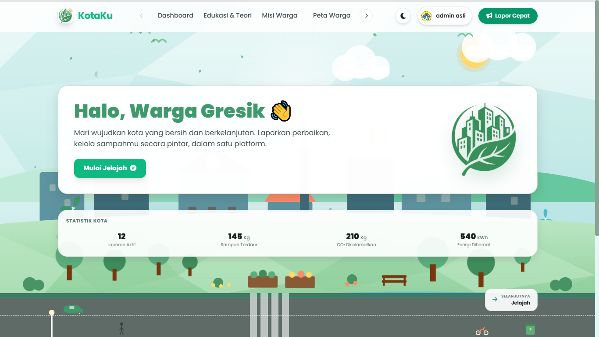
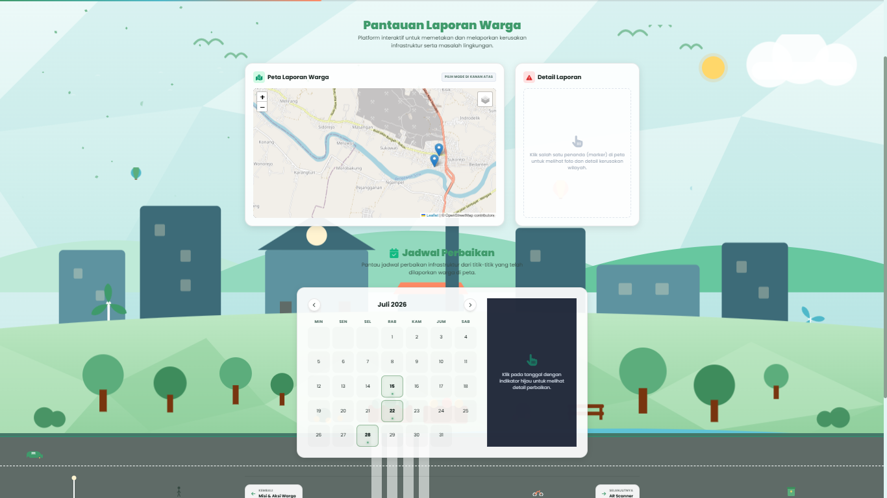
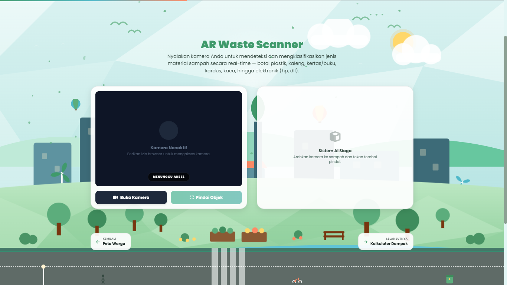
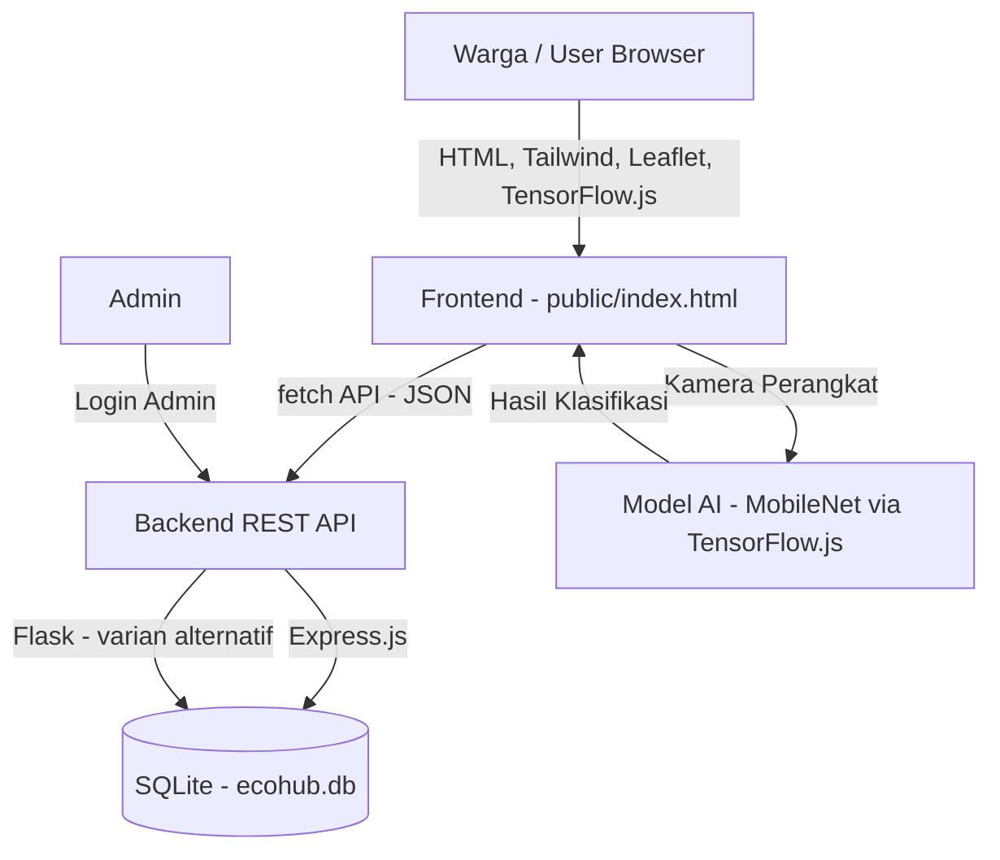
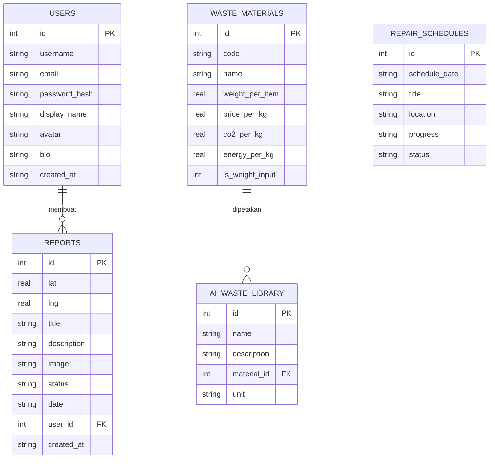

<div align="center">

# 🌿 KotaKu
### Solusi Smart City & Ekonomi Sirkular untuk Kota yang Lebih Hijau

[](https://kota-kuu.vercel.app)
[](https://github.com/citrempaks-sudo/KotaKu)
[](LICENSE)

**Submission for ITECHNO CUP 2026 - Web Development**

**By Regu Anggrek**

</div>

---

## 📋 Daftar Isi

- [Tim Developer](#-tim-developer)
- [Tentang Proyek](#-tentang-proyek)
- [Fitur Unggulan](#-fitur-unggulan)
- [Demo & Screenshot](#-demo--screenshot)
- [Teknologi](#-teknologi)
- [Arsitektur Sistem](#-arsitektur-sistem)
- [Instalasi & Setup](#️-instalasi--setup)
- [Penggunaan](#-penggunaan)
- [API Documentation](#-api-documentation)
- [Testing](#-testing)
- [Keamanan](#-keamanan)
- [Lisensi](#-lisensi)

---

## 👥 Tim Developer

| Nama | Peran | GitHub |
|------|-------|--------|
| **Miftahul Satriawan** | Project Lead & Backend Developer | [@citrempaks](https://github.com/citrempaks-sudo) |
| **Ahmad Danish Daffadin** | Frontend Developer | [@Jonmayxd](https://github.com/Jonmayxd) |
| **Muhammad Faza Syahrul Akbar** | UI/UX Designer | [@PanjolSyah](https://github.com/PanjolSyah) |

**Nama Tim:** Regu Anggrek

---

## 🎯 Tentang Proyek

### Latar Belakang

Pengelolaan sampah dan pelaporan kerusakan fasilitas publik di lingkungan perkotaan — seperti di Kabupaten Gresik — masih banyak mengandalkan cara manual: warga tidak punya saluran cepat untuk melaporkan tumpukan sampah liar atau lampu jalan yang mati, dan minim insentif nyata yang membuat warga mau memilah sampah dari rumah. Di sisi lain, edukasi mengenai ekonomi sirkular (nilai ekonomi dari sampah yang didaur ulang) masih belum banyak dikemas secara interaktif dan mudah diakses.

Kondisi ini membuka peluang digitalisasi: sebuah platform yang menghubungkan pelaporan warga, edukasi lingkungan, dan insentif ekonomi sirkular dalam satu aplikasi berbasis web, sehingga partisipasi warga dalam menjaga kota lebih mudah dan terukur.

> Catatan: Angka atau statistik spesifik terkait dampak belum tersedia dan tidak dicantumkan sebagai klaim faktual dalam dokumen ini.

### Solusi yang Ditawarkan

**KotaKu** (dengan basis data internal bernama **EcoHub**) adalah platform smart city berbasis web yang menggabungkan:

1. **Peta Laporan Warga** — warga dapat melaporkan titik kerusakan lingkungan/infrastruktur (mis. tumpukan sampah, lampu jalan mati) lengkap dengan lokasi dan foto, lalu memantau status penanganannya.
2. **AR Waste Scanner** — memanfaatkan model AI (TensorFlow.js + MobileNet) yang berjalan langsung di browser untuk mengklasifikasikan jenis sampah dari kamera pengguna secara real-time.
3. **Kalkulator Ekonomi Sirkular** — mengonversi jumlah sampah rumah tangga menjadi estimasi nilai rupiah dan potensi reduksi emisi karbon, sehingga manfaat memilah sampah terasa konkret.
4. **Edukasi Interaktif** — artikel ringkas seputar ekonomi sirkular, smart city, dan gaya hidup minim sampah.

Alur solusinya: warga membuka aplikasi → menjelajahi peta/laporan atau memindai sampah dengan kamera → hasil pemindaian dapat langsung dimasukkan ke kalkulator untuk melihat nilai ekonominya → warga juga dapat membuat laporan kerusakan yang akan dipantau melalui dashboard admin.

Aspek inovasi utamanya terletak pada penggabungan **pelaporan warga**, **AI di sisi klien** (tanpa perlu server AI terpisah), dan **insentif ekonomi sirkular** dalam satu alur pengalaman, bukan sekadar aplikasi pelaporan sampah biasa.

### Tujuan Proyek

- 🎯 **Tujuan Utama**: Mempermudah warga melaporkan masalah lingkungan/infrastruktur kota dan mendorong partisipasi dalam ekonomi sirkular melalui edukasi dan insentif yang terukur.
- 📊 **Target Pengguna**: Warga umum (khususnya wilayah perkotaan seperti Gresik) serta pengelola/admin kota yang menindaklanjuti laporan.
- 💡 **Value Proposition**: Menyatukan pelaporan warga, klasifikasi sampah berbasis AI di browser, dan kalkulator nilai ekonomi sirkular dalam satu platform ringan berbasis web tanpa instalasi tambahan.

---

## ✨ Fitur Unggulan

### Fitur Utama

| Fitur | Deskripsi | Keunggulan |
|-------|-----------|------------|
| **Peta Laporan Warga** | Warga membuat laporan titik masalah lingkungan/infrastruktur (lokasi, judul, deskripsi, foto) dan melihat statusnya (Laporan Baru, Belum Ditangani, Proses Perbaikan, Selesai). | Transparansi status penanganan, serta laporan dapat dihapus oleh pembuatnya sendiri atau admin. |
| **AR Waste Scanner** | Memindai objek sampah lewat kamera perangkat dan mengklasifikasikannya (plastik, kaleng, kertas, kardus, kaca, elektronik) menggunakan model AI yang berjalan langsung di browser. | Tidak memerlukan server AI terpisah; hasil klasifikasi bisa langsung dikirim ke kalkulator. |
| **Kalkulator Ekonomi Sirkular** | Menghitung estimasi nilai rupiah dan dampak lingkungan (CO2, energi) dari jumlah sampah yang dimasukkan pengguna. | Membuat manfaat ekonomi dari daur ulang menjadi konkret dan mudah dipahami. |
| **Jadwal Perbaikan Publik** | Menampilkan jadwal dan progres perbaikan fasilitas kota (mis. penambalan jalan, perbaikan lampu). | Warga bisa memantau tindak lanjut dari laporan yang masuk secara publik. |

### Fitur Tambahan

- **Edukasi Interaktif** - Artikel ringkas tentang ekonomi sirkular, smart city, dan energi terbarukan.
- **Autentikasi Pengguna** - Registrasi/login dengan sesi berbasis JWT serta manajemen profil (nama tampilan, avatar, bio).
- **Mode Admin** - Satu akun khusus (ditentukan lewat konfigurasi server) dapat memperbarui atau mengelola laporan warga.
- **Statistik Ringkas** - Ringkasan jumlah laporan, laporan yang masih berjalan, jadwal, dan material sampah terdaftar.

---

## 📸 Demo & Screenshot

### Live Demo
🔗 **[Kunjungi Website](https://kota-kuu.vercel.app)**

### Screenshot Aplikasi
<div align="center">
  
  <p><em>Dashboard - Tampilan utama aplikasi</em></p>

  
  <p><em>Peta Laporan Warga - Pemantauan laporan lingkungan</em></p>

  
  <p><em>AR Waste Scanner - Klasifikasi sampah berbasis AI</em></p>
</div>

### Video Demo
📹 **[Link Video Demo (dekstop)](https://youtu.be/uiQqtVCx0jQ?si=JfxXa7O2_9Nm_BhT)** 

📹 **[Link Video Demo (mobile)](https://youtube.com/shorts/xbiJCRBXVao?si=FOQgKN0V6hVkoRSO)** 

---

## 🛠 Teknologi

### Tech Stack

#### Frontend
```
Framework    : HTML5 + Tailwind CSS (via CDN)
UI Library   : Tailwind CSS, Font Awesome (ikon)
Animasi      : AOS (Animate On Scroll), GSAP + ScrollTrigger
Peta         : Leaflet.js
Grafik       : Chart.js
AI di Browser: TensorFlow.js 3.21.0 + model MobileNet 2.1.1 (klasifikasi gambar)
State Mgmt   : Vanilla JavaScript (JS.js)
Validation   : Validasi manual pada input form (client-side)
```

#### Backend
```
Runtime    : Node.js (varian utama) — tersedia juga varian Python (Flask)
Framework  : Express.js (Node) / Flask (Python)
Database   : SQLite (better-sqlite3 di Node, sqlite3 di Python)
ORM        : Tidak menggunakan ORM — query SQL langsung (prepared statements)
Auth       : JSON Web Token (jsonwebtoken) + bcryptjs untuk hashing password
```

#### DevOps & Tools
```
Deployment : Vercel (Serverless Functions, runtime @vercel/node)
             Auto-deploy dari GitHub setiap push ke branch main
Version Ctrl: Git + GitHub
CI/CD      : GitHub Actions (.github/workflows/ci.yml) — jalan otomatis
             tiap push/pull request ke branch main: install dependencies,
             lint (ESLint), build check, lalu jalankan test.
             Deployment produksi tetap lewat integrasi otomatis
             Vercel <-> GitHub (push ke main langsung ter-build & ter-deploy)
Testing    : Jest + Supertest — automated test untuk endpoint autentikasi
             (register, login, /api/auth/me), dijalankan otomatis di CI
             dan bisa dijalankan lokal lewat `npm test`
Monitoring : Vercel Logs (Runtime Logs & Function Logs) bawaan dashboard.
             Belum ada monitoring/alerting eksternal (mis. Sentry, Datadog)
```

> Catatan: Proyek ini menyediakan **dua varian backend** (Node.js/Express dan Python/Flask) yang keduanya terhubung ke database SQLite yang sama, sehingga tim dapat memilih salah satu sesuai kebutuhan deployment.

### Alasan Pemilihan Teknologi

| Teknologi | Alasan Pemilihan |
|-----------|-------------------|
| **Express.js** | Ringan, cepat disiapkan, dan mudah dipasangkan dengan middleware keamanan seperti Helmet dan rate limiting. |
| **SQLite (better-sqlite3)** | Tidak memerlukan server database terpisah, cocok untuk proyek kompetisi/prototipe, serta cukup cepat untuk skala data laporan warga. |
| **TensorFlow.js + MobileNet** | Memungkinkan klasifikasi gambar berjalan langsung di perangkat pengguna (client-side), sehingga tidak memerlukan infrastruktur server AI tambahan dan menjaga privasi gambar pengguna. |
| **JWT + bcryptjs** | Standar umum untuk autentikasi stateless yang aman, dengan hashing password yang teruji. |
| **Tailwind CSS** | Mempercepat pengembangan antarmuka yang konsisten tanpa menulis CSS kustom secara ekstensif. |
| **Leaflet.js** | Library peta interaktif yang ringan dan open-source, sesuai kebutuhan menampilkan titik laporan warga. |

### Dependencies Utama

```json
{
  "dependencies": {
    "express": "^4.19.2",
    "cors": "^2.8.5",
    "better-sqlite3": "^11.3.0",
    "dotenv": "^16.4.5",
    "helmet": "^7.1.0",
    "express-rate-limit": "^7.4.0",
    "bcryptjs": "^2.4.3",
    "jsonwebtoken": "^9.0.2"
  }
}
```

Varian backend Python menggunakan:
```
flask==3.0.3
flask-cors==4.0.1
```

---

## 🏗 Arsitektur Sistem

### System Architecture



### Database Schema



### Folder Structure

```
itec/
├── public/                    # Frontend (dilayani sebagai static files)
│   ├── index.html             # Halaman utama aplikasi (SPA sederhana)
│   ├── CSS.css                # Styling kustom
│   ├── JS.js                  # Logika frontend (peta, scanner, kalkulator, dll)
│   ├── tailwind-config.js     # Konfigurasi Tailwind
│   ├── logo.jpeg
│   └── assets/img/            # Aset gambar edukasi
├── backend/
│   ├── README.md              # Dokumentasi kedua varian backend
│   ├── node/                  # Varian backend Node.js (Express)
│   │   ├── server.js
│   │   └── package.json
│   └── python/                # Varian backend Python (Flask)
│       ├── app.py
│       └── requirements.txt
├── database/
│   └── database.sql           # Skema tabel + seed data (salinan)
├── server.js                  # Backend utama (Express) yang menyajikan /public
├── database.sql               # Skema database (SQLite)
├── ecohub.db                  # File database SQLite
├── package.json
└── .env                       # Konfigurasi environment (tidak disertakan di repo)
```

---

## ⚙️ Instalasi & Setup

### Prerequisites

Pastikan Anda telah menginstall:
- **Node.js** v18.x atau lebih tinggi (untuk varian backend Node.js)
- **npm**
- **Python 3** (opsional, jika ingin menjalankan varian backend Flask)
- **Git**

### 1️⃣ Clone Repository

```bash
git clone https://github.com/citrempaks-sudo/KotaKu
```

### 2️⃣ Install Dependencies

**Backend Node.js (utama):**
```bash
npm install
```

**Backend Python (opsional, varian alternatif):**
```bash
cd backend/python
pip install -r requirements.txt
cd ../..
```

### 3️⃣ Setup Environment Variables

Buat file `.env` di root proyek (jangan pernah commit file ini ke repository):

```env
PORT=3000
JWT_SECRET="[isi_dengan_secret_jwt_anda_sendiri_yang_acak_dan_panjang]"
ADMIN_USERNAME="[isi_dengan_username_admin_pilihan_anda]"
ALLOWED_ORIGINS=http://localhost:3000,http://127.0.0.1:3000

# Opsional — hanya perlu diisi jika ingin memakai lokasi file database
# yang berbeda dari default (kotaku.db di root proyek)
# DB_PATH=./kotaku.db
```

> ⚠️ Jangan pernah memasukkan API key, password, token, secret, atau credential asli ke dalam repository publik.

### 4️⃣ Setup Database

Database SQLite (`ecohub.db`) dapat dibuat menggunakan skema yang tersedia:

```bash
# Menggunakan Python
python create_database.py

# atau menjalankan skema SQL secara langsung
sqlite3 ecohub.db < database.sql
```

### 5️⃣ Run Development Server

```bash
# Backend Node.js (menyajikan frontend & API di port yang sama)
npm run dev

# atau mode produksi
npm start
```

Aplikasi akan berjalan di `http://localhost:3000`

Jika ingin menjalankan varian backend Python:
```bash
cd backend/python
python app.py
```
Server Flask akan berjalan di `http://localhost:5000`

---

## 🚀 Penggunaan

### Menjalankan Aplikasi

```bash
# Development mode (auto-restart saat file berubah)
npm run dev

# Production mode
npm start

# Seed ulang database
npm run seed

# Test & lint
npm test
npm run lint
```

### User Guide

1. **Membuka aplikasi** — akses `http://localhost:3000` (atau URL live demo).
2. **Registrasi/Login** (opsional) — warga dapat menggunakan aplikasi sebagai tamu, atau mendaftar untuk dapat mengelola laporan miliknya sendiri.
3. **Menjelajahi fitur** — memilih salah satu fitur utama: Peta Laporan, AR Waste Scanner, Kalkulator Ekonomi Sirkular, atau Edukasi.
4. **Membuat laporan** — mengisi judul, deskripsi, lokasi, dan foto laporan kerusakan/tumpukan sampah.
5. **Memindai sampah** — mengaktifkan kamera pada fitur AR Waste Scanner untuk mengklasifikasikan jenis sampah, lalu mengirim hasilnya ke Kalkulator Ekonomi Sirkular.
6. **Melihat hasil** — memantau status laporan yang dibuat serta estimasi nilai ekonomi dari sampah yang dihitung.

### Admin Guide

Aplikasi memiliki **satu peran admin khusus**, ditentukan melalui variabel `ADMIN_USERNAME` di `.env` dan diverifikasi lewat token login (bukan kunci terpisah).

1. **Login sebagai admin** — masuk menggunakan akun yang username-nya sama persis dengan `ADMIN_USERNAME`.
2. **Verifikasi status admin** — melalui endpoint `GET /api/admin/verify`.
3. **Mengelola laporan** — admin dapat memperbarui status laporan warga (mis. dari "Belum Ditangani" menjadi "Proses Perbaikan" atau "Selesai") melalui `PUT /api/reports/:id`, serta menghapus laporan apa pun.

---

## 📚 API Documentation

### Base URL
```
Development (Node.js) : http://localhost:3000/api
Development (Python)  : http://localhost:5000/api
Production             : https://kota-kuu.vercel.app/api
```

### Authentication

Autentikasi menggunakan **JSON Web Token (JWT)**. Sertakan token pada header berikut untuk endpoint yang memerlukan login:
```
Authorization: Bearer <token>
```

### Endpoints

#### Autentikasi
```http
POST /api/auth/register
POST /api/auth/login
GET  /api/auth/me
PUT  /api/auth/profile
PUT  /api/auth/password
GET  /api/admin/verify
```

#### Laporan Warga (Reports)
```http
GET    /api/reports
GET    /api/reports/:id
POST   /api/reports
PUT    /api/reports/:id
DELETE /api/reports/:id
```

#### Material Sampah & Pustaka AI
```http
GET /api/waste
GET /api/waste/:code
GET /api/ai-library
```

#### Jadwal Perbaikan & Statistik
```http
GET /api/schedules
GET /api/schedules/:date
GET /api/stats
```

### Contoh Request

**Login:**
```javascript
const response = await fetch('/api/auth/login', {
  method: 'POST',
  headers: { 'Content-Type': 'application/json' },
  body: JSON.stringify({
    username: 'namapengguna',
    password: 'password_anda'
  })
});
```

**Membuat Laporan:**
```javascript
const response = await fetch('/api/reports', {
  method: 'POST',
  headers: { 'Content-Type': 'application/json' },
  body: JSON.stringify({
    lat: -7.054,
    lng: 112.571,
    title: 'Tumpukan Sampah di Taman',
    description: 'Sampah menumpuk di sudut taman.',
    date: '25 Juli 2026'
  })
});
```

### Error Response

Semua error dikembalikan dalam format berikut, tanpa membocorkan detail internal server:
```json
{
  "error": "Pesan kesalahan yang relevan"
}
```

---

## 🧪 Testing

Proyek ini memiliki **automated test** untuk endpoint autentikasi, dijalankan otomatis lewat GitHub Actions setiap ada push/pull request ke branch `main`.

```
Framework  : Jest + Supertest
Cakupan    : POST /api/auth/register, POST /api/auth/login, GET /api/auth/me
             (kasus sukses, validasi input, kredensial salah, token tidak valid)
Lokasi     : tests/auth.test.js
```

### Running Tests

```bash
# Unit / integration test (auth endpoints)
npm test

# Test coverage
npm run test:coverage
```

> Proyek ini belum memiliki test E2E (end-to-end) terpisah — pengujian alur pengguna secara menyeluruh (buka halaman, isi form, klik tombol) masih dilakukan manual selama pengembangan, bukan lewat automated E2E tool (mis. Playwright/Cypress).

### Test Coverage

```
Statements : (jalankan `npm run test:coverage` untuk melihat angka aktual)
Branches   : (jalankan `npm run test:coverage` untuk melihat angka aktual)
Functions  : (jalankan `npm run test:coverage` untuk melihat angka aktual)
Lines      : (jalankan `npm run test:coverage` untuk melihat angka aktual)
```

> Angka coverage di atas sengaja tidak diisi manual di dokumen ini — jalankan `npm run test:coverage` secara lokal (atau lihat log job CI di GitHub Actions) untuk mendapatkan angka yang sebenarnya, lalu isi tabel ini sebelum submission final.

> Cakupan test saat ini masih berfokus pada alur autentikasi (bagian paling kritikal secara keamanan). Endpoint laporan, kalkulator, dan fitur lain masih diuji secara manual selama pengembangan — arah pengembangan berikutnya adalah memperluas cakupan test ke endpoint-endpoint tersebut.

---

## 🔒 Keamanan

Beberapa langkah keamanan yang sudah diterapkan pada backend:

- **Authentication & Authorization** — login berbasis JWT, dengan peran admin tunggal yang diverifikasi dari klaim `username` pada token.
- **Password Hashing** — password pengguna di-hash menggunakan `bcryptjs` sebelum disimpan.
- **Input Validation & Sanitasi** — input laporan (judul, deskripsi, lokasi, gambar) dibersihkan dari tag HTML dan dibatasi panjangnya untuk mencegah stored XSS.
- **Rate Limiting** — endpoint login/registrasi dan pembuatan laporan dibatasi frekuensinya untuk mencegah brute-force dan spam.
- **HTTP Security Headers** — menggunakan `helmet` dengan Content Security Policy yang dikonfigurasi khusus.
- **Environment Variables** — kredensial (JWT secret, admin key) disimpan di `.env` dan tidak di-hardcode dalam kode sumber.

> Sistem ini **tidak diklaim 100% aman**; langkah-langkah di atas adalah praktik dasar yang diterapkan pada tahap pengembangan/kompetisi ini.

---

## 📄 Lisensi

`MIT License` — lihat file [LICENSE](LICENSE) untuk ketentuan lengkap.

---

<div align="center">

**Made with ❤️ by Regu Anggrek for ITECHNO CUP 2026**

</div>
